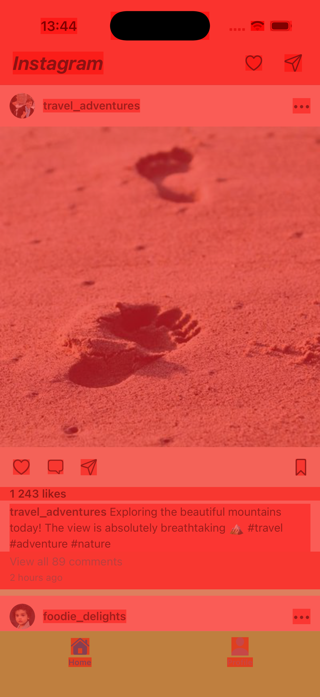
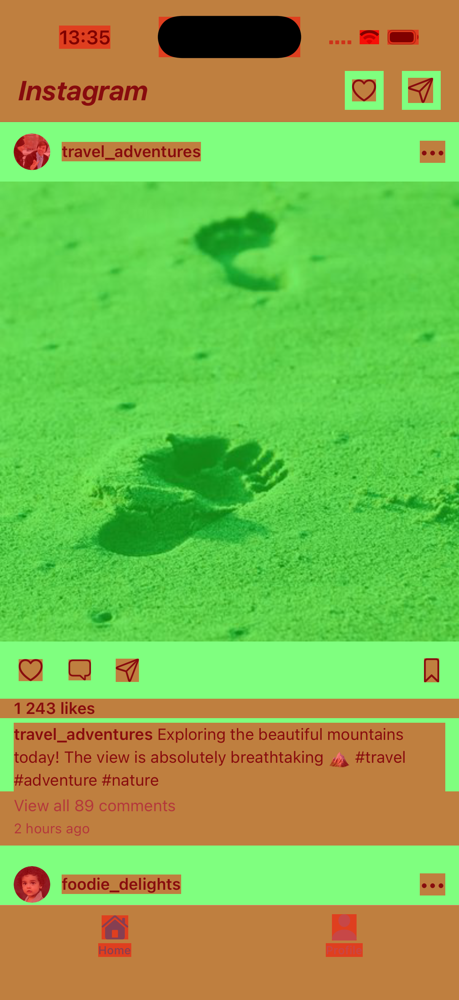
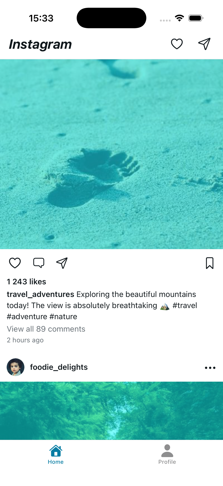
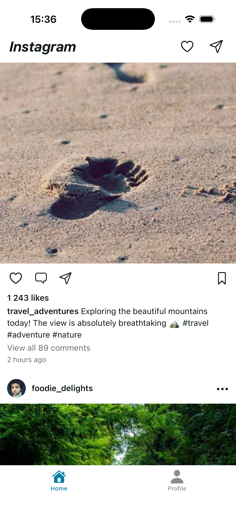
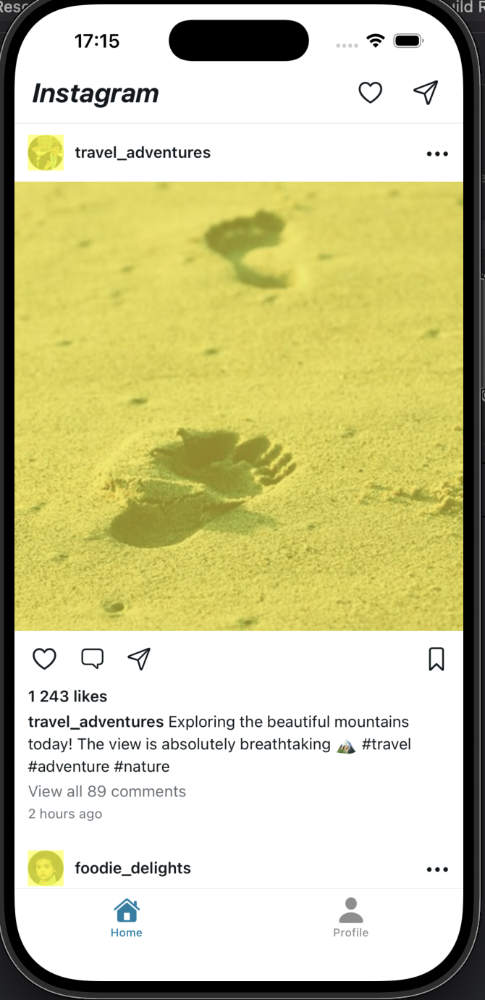

# iOS UI Debugging Tools

## Rendering debug options

iOS provides a set of tools for debugging UI rendering. They allow you to visually highlight problematic layers, for example ones that are rendered offscreen, blended or copied unnecessarily.

### Color Blended Layers

When a layer is transparent, the GPU can't just draw it directly. It has to look at the layers underneath and mix the colors together. The more layers it has to blend through, the more work it does per pixel.

This tool overlays red on non-opaque layers and green on opaque ones. **The darker the red, the more blending is going on.**

The first screenshot below shows how the app looks to the user. The other two show the same screen with Color Blended Layers enabled, but with different amounts of transparency applied to components. The app looks the same to the user in both cases, but the GPU blending workload is very different:

<table>
<tr>
<td align="center" width="200"></td>
<td align="center" width="200"></td>
<td align="center" width="200"></td>
</tr>
<tr>
<td align="center"><em>Debug overlay off</em></td>
<td align="center"><em>Many transparent layers</em></td>
<td align="center"><em>Solid background colors</em></td>
</tr>
</table>

The middle version uses `opacity` and `rgba` transparent backgrounds on almost every component. The GPU has to blend through the entire view hierarchy for every pixel, which gets especially expensive in deep component trees. The right version sets solid white backgrounds on the same components. Visually nothing changes, but the GPU can now skip blending on those layers entirely.

**A quick win is to give layers a solid background color matching whatever is behind them.** Visually nothing changes, but the GPU now treats the layer as opaque and skips blending entirely. You won't be able to eliminate all blending in a real app (text anti-aliasing and vector icons will always need some), but reducing it on large surfaces can give a noticeable performance improvement on heavy apps and low-end devices.

### Color Copied Images

The GPU can only work with specific pixel formats. When an image uses something else, like a CMYK color space, 16 bits per channel instead of 8, or an unexpected byte layout, Core Animation has to convert and copy the entire bitmap into a GPU-compatible buffer. This happens on the main thread during the render pass, and in a scrolling feed with dozens of images it adds up fast.

<table>
<tr>
<td align="center" width="200"></td>
<td align="center" width="200"></td>
</tr>
<tr>
<td align="center"><em>CMYK images, converted on main thread</em></td>
<td align="center"><em>sRGB images, no conversion needed</em></td>
</tr>
</table>

On the left, the feed is loaded with CMYK JPEG images. The blue overlay means every one of those images is being converted to a GPU-compatible format on the main thread. On the right, the same feed uses standard sRGB images and there's nothing to convert.

**The simplest fix is to use a GPU-compatible format in the first place. When you don't control the source, you can convert images to the right format on a background thread before they hit the render pipeline.**

### Color Misaligned Images

Yellow overlay appears when an image's edges aren't pixel-aligned or when the image is being scaled (its pixel dimensions don't match the size it's being drawn at). Both cost extra GPU read bandwidth because the GPU has to do more work per pixel to figure out what color to put on screen.

<table>
<tr>
<td align="center" width="200"></td>
<td align="center" width="200"></td>
</tr>
<tr>
<td align="center"><em>scaleAspectFit, icons scaled up</em></td>
<td align="center"><em>center, no scaling</em></td>
</tr>
</table>

In this example the yellow overlay appears on all SF Symbol icons (heart, comment, share, bookmark, tab bar icons). `expo-symbols` configures every symbol at a fixed 14pt font size internally (`UIFont.systemFontSize`), regardless of the container size you set in your code. When you render an icon at 24pt or 26pt with `scaleAspectFit`, the symbol has to be scaled up to fill the container, and the tool picks that up. Switching to `center` removes the scaling entirely because the symbol just renders at its natural size without being stretched. The icons end up smaller, but there is no misalignment.

### Color Off-screen Rendered (Yellow)

<table>
<tr>
<td align="center" width="200"></td>
</tr>
<tr>
<td align="center"><em>border radius causes an offscreen pass</em></td>
</tr>
</table>

TBD - Why is the post image also being rendered offscreen?

### Color Compositing Fast-Blue

The opposite of the other tools. Blue overlay means the GPU can composite these layers through a fast path. Seeing blue is a good thing.

TBD

### Flash Updated Regions

Flashes yellow over any part of the screen that gets redrawn. Useful for spotting unnecessary repaints. If you tap a button and half the screen flashes, something is redrawing way more than it should. Ideally only the views that actually changed should light up.

TBD

## Where to find these options

Important thing: not all rendering debug options are available in the same place. It depends on whether you are running the app on a simulator or on a physical device.

### Physical device

On a physical device you can find the rendering options in Xcode:

**Debug → View Debugging → Rendering**

All options listed above are available there. Additionally, on a physical device you have access to options like:

- **Induce Device Conditions** lets you simulate thermal throttling (CPU slowdown)
- **Simulate MetricKit Payloads**
- **Capture GPU Workload**

These options are greyed out when using the simulator.

### Simulator

On the simulator the rendering options in Xcode (Debug → View Debugging → Rendering) will be greyed out. Instead you need to use the Simulator app menu directly:

**Simulator → Debug → Color Off-screen Rendered / Color Blended Layers / ...**

This is a separate menu in the Simulator app, not in Xcode.

